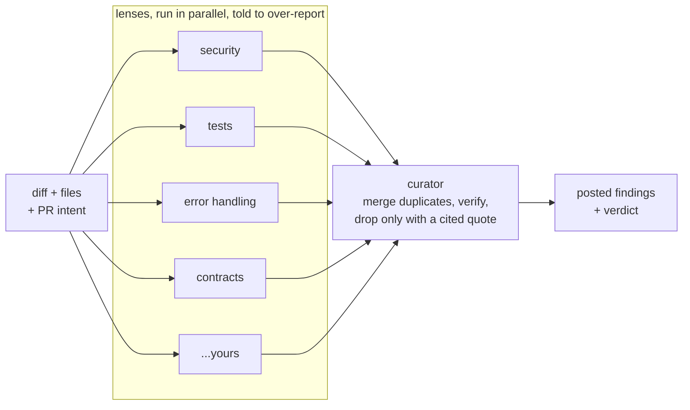

<p align="center">
  
</p>

<h1 align="center">Argus</h1>

<p align="center">
  An open source AI PR reviewer built from many narrow lenses and one careful curator.
</p>

<p align="center">
  <a href="https://github.com/sibinms/argus/actions/workflows/ci.yml"></a>
  <a href="https://github.com/sibinms/argus/releases"></a>
  <a href="LICENSE"></a>
  
  <a href="https://github.com/astral-sh/ruff"></a>
</p>

---

Most AI code reviewers are one cautious model doing two jobs at once:
proposing problems, and deciding which ones are real. Caution wins, and the
reviewer goes quiet — approving pull requests it never actually looked hard
at, because it was never willing to write down the suspicion in the first
place. Argus splits the two jobs: many narrow lenses propose freely, and one
curator decides what survives, and can only prove a finding wrong, never just
doubt it.

## Table of Contents

- [Quick Start](#quick-start)
- [Why use Argus?](#why-use-argus)
- [Features](#features)
- [How it works](#how-it-works)
- [Configuration](#configuration)
- [Writing your own lenses](#writing-your-own-lenses)
- [Measuring recall, not silence](#measuring-recall-not-silence)
- [Data privacy](#data-privacy)
- [Quality and security checks](#quality-and-security-checks)
- [Releases](#releases)
- [Design notes](#design-notes)
- [Contributing](#contributing)

## Quick Start

### 1. GitHub Action (recommended)

```yaml
# .github/workflows/argus.yml
name: Argus review
on: pull_request

jobs:
  review:
    runs-on: ubuntu-latest
    permissions:
      contents: read
      pull-requests: write
    steps:
      - uses: sibinms/argus@v1.2.1
        with:
          anthropic-api-key: ${{ secrets.ANTHROPIC_API_KEY }}
```

Argus works with any provider [litellm](https://docs.litellm.ai/docs/providers)
supports — set the model strings in `.argus/config.yml` and pass that
provider's own key via the step's `env:` instead of `anthropic-api-key`:

```yaml
      - uses: sibinms/argus@v1.2.1
        env:
          OPENAI_API_KEY: ${{ secrets.OPENAI_API_KEY }}
```

> **Heads up: `mode: active` is the default.** As soon as this workflow runs
> on a pull request, Argus posts real inline comments and a verdict (approve,
> comment, or request changes) using the GitHub review API — there's no
> separate opt-in step. If you want to see what it would say before it says
> anything on a real PR, set `mode: shadow` in `.argus/config.yml` first: it
> writes a job summary and changes nothing on the PR. Switch to `mode: active`
> (or delete the line, since it's the default) once you're happy with what
> it's finding.

### 2. CLI (local runs)

```bash
pip install "git+https://github.com/sibinms/argus.git@v1.2.1"
argus init                 # writes .argus/config.yml
export ANTHROPIC_API_KEY=sk-...   # or OPENAI_API_KEY, GEMINI_API_KEY, ... — whatever
                                   # provider the models in .argus/config.yml point at
argus review --base origin/main --head HEAD
```

Not on PyPI yet — installing straight from a tagged commit keeps this
pinned the same way the Action example above is. (If you're wondering why
not `pip install argus-review`: that name's already taken on PyPI by an
unrelated project, so ours would publish under `argus-pr-review` instead,
once it's there.)

> If that install fails with a Rust/`maturin` build error, it's a transitive
> dependency (`tokenizers`, via litellm) trying to compile from source
> because no prebuilt wheel matched your platform/Python version. Add
> `--only-binary=:all:` to the pip command above, or run `rustup update`
> first if you'd rather build it.

This runs against a local diff and writes `argus-report.md`. Posting only
ever happens when there's a real PR to post to (`--github`), so a local run
like this never touches anything — it's a safe way to read the panel's
output before it's aimed at a real pull request.

### 3. Other platforms

GitHub is the only supported platform right now (GitHub Action + GitHub
review API). GitLab/Bitbucket/Azure DevOps support isn't built — contributions
welcome, see [Contributing](#contributing).

## Why use Argus?

- **Built to actually find things.** Every lens is explicitly told to
  over-report, because a single cautious reviewer that never writes down a
  suspicion also never catches the real bug behind it.
- **Precision is enforced once, not everywhere.** The curator is the only
  place a finding can be dropped, and it can't just be "unsure" — it has to
  quote real text from the diff that contradicts the finding, or the finding
  survives (downgraded, not deleted).
- **Cheap where it should be, careful where it matters.** Lenses run on a
  cheap model for volume; the curator can run on your strongest model, since
  judgment — not generation — is where quality actually pays off.
- **Measured, not vibes-checked.** `eval/run_eval.py` replays known bugs
  through the full pipeline and reports recall, so a prompt or context change
  is judged on whether it actually catches more, not on how it reads.
- **Open, no vendor lock-in.** Bring your own API key for whichever provider
  you prefer (Anthropic, OpenAI, Gemini, and anything else
  [litellm](https://docs.litellm.ai/docs/providers) supports), run it as a
  GitHub Action or the CLI, and read every prompt in `src/argus/lenses/builtin/`
  — nothing about what it looks for is hidden.

## Features

| Lens | What it flags |
|---|---|
| `security` | Injection, broken auth, hardcoded secrets, unsafe deserialization, sensitive data in logs |
| `tests` | New logic with no test, bug fixes with no regression test, weak assertions, silently skipped tests |
| `error_handling` | Swallowed exceptions, missing timeouts, unreleased resources, retries with no idempotency |
| `contracts` | Breaking API/schema changes, callers still using old assumptions, changed defaults |
| *(yours)* | Anything — lenses are plain markdown, see [Writing your own lenses](#writing-your-own-lenses) |

| Capability | Support |
|---|---|
| Shadow mode (report only, never posts) | ✅ |
| Active mode (inline comments + verdict) | ✅ |
| Evidence-checked curator (can't drop without a citation) | ✅ |
| Custom lenses via markdown, no code | ✅ |
| Recall eval harness against seed bugs | ✅ |
| Any provider [litellm](https://docs.litellm.ai/docs/providers) supports (Anthropic, OpenAI, Gemini, ...), mixed per role | ✅ |
| GitHub Action | ✅ |
| CLI (local diffs) | ✅ |
| GitLab / Bitbucket / Azure DevOps | ❌ (contributions welcome) |

## How it works



Lenses run in parallel on a cheap model and are told to over-report. The
curator — the only place precision is enforced — merges duplicates and can
only drop a finding by quoting real text from the diff that contradicts it;
see [Design notes](#design-notes) for why that's checked in code, not just
asked for in a prompt.

## Configuration

See [`.argus/config.yml.example`](.argus/config.yml.example) for every
option: which model plays lens vs. curator, which lenses run, context size
limits, and the confidence floor for posting. Model strings can be anything
[litellm](https://docs.litellm.ai/docs/providers) supports — `claude-haiku-4-5`,
`gpt-4o-mini`, `gemini/gemini-1.5-flash`, and so on — and lens and curator
don't need to share a provider. Copy the example to `.argus/config.yml` and
commit it — this file is the one piece of the tool a user should read before
trusting it with their repo.

## Writing your own lenses

Lenses are plain markdown, no code. See
[`docs/writing-a-lens.md`](docs/writing-a-lens.md).

## Measuring recall, not silence

A reviewer that finds nothing and a reviewer that's actually correct look
identical from the outside — dashboards that count posted/filtered findings
miss that a finding was never generated in the first place. `eval/run_eval.py`
replays a small set of known bugs (see `eval/seed_bugs/`) through the full
pipeline and reports recall: how many of them it actually catches.

```bash
export ANTHROPIC_API_KEY=sk-...   # or whichever provider key your config needs
python eval/run_eval.py
```

Add your own seeds pulled from your repo's real bug-fix history — a
`diff.patch` plus an `expected.yml` describing what a good review should
have caught. Run the eval before and after any change to prompts, context
budgets, or lenses. If a change doesn't move recall up, don't ship it on
intuition alone.

## Data privacy

Argus is self-hosted in the sense that matters: it runs in *your* GitHub
Action or *your* CLI, using *your* API key for whichever provider you've
configured, and it doesn't call home to any Argus-operated service — there
isn't one.

What that means in practice:

- The diff, the changed files (subject to your `context` budget in
  `.argus/config.yml`), and the PR title/description are sent to whichever
  provider your `models.lens` and `models.curator` strings point at (via
  [litellm](https://docs.litellm.ai/docs/providers), which routes the call —
  it doesn't sit in front of it as its own service). Nothing else leaves your
  CI runner or machine.
- Whether that data is used for model training is governed by that provider's
  own API data usage policy, not by Argus — the same as any tool built on
  their API. Lens and curator can point at different providers, so check the
  policy for each one you've configured.
- Argus stores nothing itself: no database, no third-party logging, no
  telemetry. The only output is the report file and, in active mode, the
  comments it posts on your own PR via the GitHub token you provide.

## Quality and security checks

Every push and pull request runs through
[`.github/workflows/ci.yml`](.github/workflows/ci.yml):

| Job | What it checks |
|---|---|
| `lint` | [Ruff](https://github.com/astral-sh/ruff) — style and common bugs, plus formatting — and that the README's pinned version matches `pyproject.toml` |
| `typecheck` | [mypy](https://mypy-lang.org/) against `src/` |
| `security` | [Bandit](https://bandit.readthedocs.io/) (static analysis) and [pip-audit](https://github.com/pypa/pip-audit) (known CVEs in dependencies) |
| `codeql` | [GitHub CodeQL](https://codeql.github.com/), also scheduled weekly so new advisories get caught between pushes |
| `test` | the `pytest` suite |

Run the same checks locally before pushing:

```bash
pip install -e ".[dev]"
ruff check src tests eval scripts && ruff format --check src tests eval scripts
python scripts/check_readme_version.py
mypy src
bandit -r src && pip-audit --skip-editable
pytest
```

## Releases

Tags follow semver (`v1.2.1`, ...). Pin the Action to a specific tag rather
than `@main` — `@main` tracks whatever's newest, including changes to lens
prompts or curator behaviour that could shift what gets posted on your PRs.
See [Releases](https://github.com/sibinms/argus/releases) for the changelog
on each version.

## Design notes

A few decisions that aren't obvious from the code:

- **Context is deliberately narrow.** No "explore the repo" agent mode, no
  full-file dumps beyond the changed files, no auto-included caller context.
  Wide context repeatedly measured *worse* recall in testing: models read
  bulk usage as reassurance ("this must be handled somewhere") rather than
  evidence. Widen it in your own config if you've measured it helping for
  your codebase — don't assume more context is free.
- **The curator's drops are checked, not trusted.** `curator/evidence.py`
  verifies that any quote the curator offers as grounds for dropping a
  finding actually appears in the diff or files. If it can't be verified,
  the finding is kept (downgraded) instead of silently deleted.
- **Cheap model for volume, expensive model for judgment.** Put your
  strongest model on `curator`, not `lens` — a lens's job is to generate
  candidates, not to be right the first time.
- **Active by default, on purpose.** A reviewer that only ever writes to a
  report file nobody reads doesn't help anyone. Defaulting to `mode: active`
  means the tool does its actual job — posting a real verdict — the moment
  it's added to a repo, instead of asking every new user to find the config
  option that turns it on. The tradeoff is real: it will comment on your very
  first PR. Use `mode: shadow` if you'd rather watch it work before it's
  aimed at anything.

## Contributing

Issues and pull requests are welcome. If you're adding a lens, see
[`docs/writing-a-lens.md`](docs/writing-a-lens.md) and run `eval/run_eval.py`
before/after to show it moves recall. If you're changing curator or context
behaviour, the same applies: the eval harness is the thing to check, not
intuition. Support for other git platforms (GitLab, Bitbucket, Azure DevOps)
is open territory — nothing in `src/argus/posting/` assumes GitHub beyond
that one module.

## License

MIT, see [LICENSE](LICENSE).
