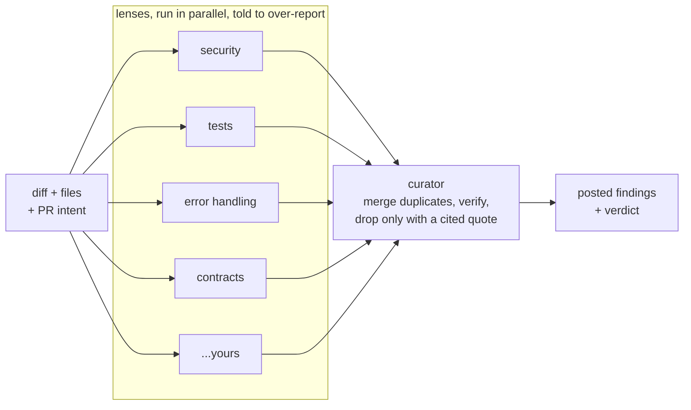

<p align="center">
  
</p>

<h1 align="center">Argus</h1>

<p align="center">
  An open source AI PR reviewer built from many narrow lenses and one careful curator.
</p>

<p align="center">
  <a href="https://github.com/sibinms/argus/actions/workflows/ci.yml"></a>
  <a href="https://github.com/sibinms/argus/releases"></a>
  <a href="LICENSE"></a>
  
  <a href="https://github.com/astral-sh/ruff"></a>
</p>

---

Most AI code reviewers are one cautious model doing two jobs at once:
proposing problems, and deciding which ones are real. Caution wins, and the
reviewer goes quiet — approving pull requests it never actually looked hard
at, because it was never willing to write down the suspicion in the first
place.

Argus splits the two jobs:

- **Lenses** are small, narrow reviewers, each briefed on one angle
  (security, missing tests, error handling, contract breaks, or whatever you
  add). They run on a cheap model and are explicitly told to over-report.
- **The curator** looks at everything the lenses raised, merges duplicates,
  and can only drop a finding if it can quote real text from the diff that
  contradicts it. "I doubt it" isn't a reason. If it can't back the claim,
  the finding survives, downgraded rather than deleted.



Lenses run in parallel and are told to over-report. The curator is the only
place precision is enforced, and it can be checked — see
[Design notes](#design-notes).

## Contents

- [Quick start](#quick-start)
- [As a GitHub Action](#as-a-github-action)
- [Configuration](#configuration)
- [Writing your own lenses](#writing-your-own-lenses)
- [Measuring recall, not silence](#measuring-recall-not-silence)
- [Quality and security checks](#quality-and-security-checks)
- [Releases](#releases)
- [Design notes](#design-notes)
- [Contributing](#contributing)

## Quick start

```bash
pip install argus-review
argus init                 # writes .argus/config.yml
export ANTHROPIC_API_KEY=sk-...
argus review --base origin/main --head HEAD
```

This runs against a local diff and writes `argus-report.md`. Posting only
ever happens when there's a real PR to post to (`--github`), so a local run
like this never touches anything — it's a safe way to read the panel's
output before it's aimed at a real pull request.

## As a GitHub Action

```yaml
# .github/workflows/argus.yml
name: Argus review
on: pull_request

jobs:
  review:
    runs-on: ubuntu-latest
    permissions:
      contents: read
      pull-requests: write
    steps:
      - uses: sibinms/argus@v1.0.0
        with:
          anthropic-api-key: ${{ secrets.ANTHROPIC_API_KEY }}
```

> **Heads up: `mode: active` is the default.** As soon as this workflow runs
> on a pull request, Argus posts real inline comments and a verdict (approve,
> comment, or request changes) using the GitHub review API — there's no
> separate opt-in step. If you want to see what it would say before it says
> anything on a real PR, set `mode: shadow` in `.argus/config.yml` first: it
> writes a job summary and changes nothing on the PR. Switch to `mode: active`
> (or delete the line, since it's the default) once you're happy with what
> it's finding.

## Configuration

See [`.argus/config.yml.example`](.argus/config.yml.example) for every
option: which model plays lens vs. curator, which lenses run, context size
limits, and the confidence floor for posting. Copy it to `.argus/config.yml`
and commit it — this file is the one piece of the tool a user should read
before trusting it with their repo.

## Writing your own lenses

Lenses are plain markdown, no code. See
[`docs/writing-a-lens.md`](docs/writing-a-lens.md).

## Measuring recall, not silence

A reviewer that finds nothing and a reviewer that's actually correct look
identical from the outside — dashboards that count posted/filtered findings
miss that a finding was never generated in the first place. `eval/run_eval.py`
replays a small set of known bugs (see `eval/seed_bugs/`) through the full
pipeline and reports recall: how many of them it actually catches.

```bash
export ANTHROPIC_API_KEY=sk-...
python eval/run_eval.py
```

Add your own seeds pulled from your repo's real bug-fix history — a
`diff.patch` plus an `expected.yml` describing what a good review should
have caught. Run the eval before and after any change to prompts, context
budgets, or lenses. If a change doesn't move recall up, don't ship it on
intuition alone.

## Quality and security checks

Every push and pull request runs through
[`.github/workflows/ci.yml`](.github/workflows/ci.yml):

| Job | What it checks |
|---|---|
| `lint` | [Ruff](https://github.com/astral-sh/ruff) — style and common bugs, plus formatting |
| `typecheck` | [mypy](https://mypy-lang.org/) against `src/` |
| `security` | [Bandit](https://bandit.readthedocs.io/) (static analysis) and [pip-audit](https://github.com/pypa/pip-audit) (known CVEs in dependencies) |
| `codeql` | [GitHub CodeQL](https://codeql.github.com/), also scheduled weekly so new advisories get caught between pushes |
| `test` | the `pytest` suite |

Run the same checks locally before pushing:

```bash
pip install -e ".[dev]"
ruff check src tests eval && ruff format --check src tests eval
mypy src
bandit -r src && pip-audit --skip-editable
pytest
```

## Releases

Tags follow semver (`v1.0.0`, ...). Pin the Action to a specific tag rather
than `@main` — `@main` tracks whatever's newest, including changes to lens
prompts or curator behaviour that could shift what gets posted on your PRs.
See [Releases](https://github.com/sibinms/argus/releases) for the changelog
on each version.

## Design notes

A few decisions that aren't obvious from the code:

- **Context is deliberately narrow.** No "explore the repo" agent mode, no
  full-file dumps beyond the changed files, no auto-included caller context.
  Wide context repeatedly measured *worse* recall in testing: models read
  bulk usage as reassurance ("this must be handled somewhere") rather than
  evidence. Widen it in your own config if you've measured it helping for
  your codebase — don't assume more context is free.
- **The curator's drops are checked, not trusted.** `curator/evidence.py`
  verifies that any quote the curator offers as grounds for dropping a
  finding actually appears in the diff or files. If it can't be verified,
  the finding is kept (downgraded) instead of silently deleted.
- **Cheap model for volume, expensive model for judgment.** Put your
  strongest model on `curator`, not `lens` — a lens's job is to generate
  candidates, not to be right the first time.
- **Active by default, on purpose.** A reviewer that only ever writes to a
  report file nobody reads doesn't help anyone. Defaulting to `mode: active`
  means the tool does its actual job — posting a real verdict — the moment
  it's added to a repo, instead of asking every new user to find the config
  option that turns it on. The tradeoff is real: it will comment on your very
  first PR. Use `mode: shadow` if you'd rather watch it work before it's
  aimed at anything.

## Contributing

Issues and pull requests are welcome. If you're adding a lens, see
[`docs/writing-a-lens.md`](docs/writing-a-lens.md) and run `eval/run_eval.py`
before/after to show it moves recall. If you're changing curator or context
behaviour, the same applies: the eval harness is the thing to check, not
intuition.

## License

MIT, see [LICENSE](LICENSE).
