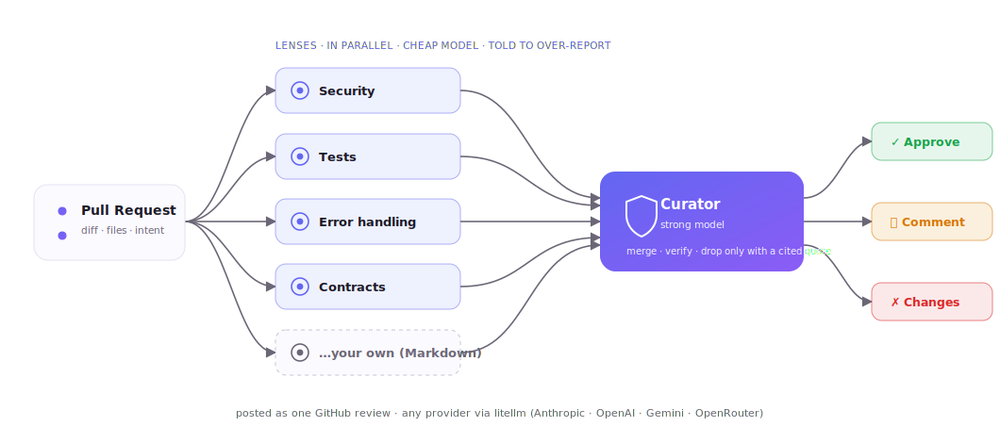

<p align="center">
  
</p>

<h1 align="center">Argus</h1>

<p align="center">
  Many narrow lenses over-report. One curator drops a finding only if it can quote the diff proving it wrong.
</p>

<p align="center">
  <a href="https://github.com/sibinms/argus/actions/workflows/ci.yml"></a>
  <a href="https://github.com/sibinms/argus/releases"></a>
  <a href="LICENSE"></a>
  
  <a href="https://github.com/astral-sh/ruff"></a>
</p>

---

Argus runs multiple specialized AI reviewers in parallel, then uses an
evidence-based curator to verify findings before posting review comments
on your pull requests.

**Highlights**

-   🔍 Parallel specialized reviewers ("lenses")
-   🧠 Evidence-based curator
-   🤖 Bring your own LLM (OpenAI, Anthropic, Gemini, OpenRouter, any LiteLLM provider)
-   🔒 Runs entirely in your GitHub Action or locally
-   📝 Markdown-based custom lenses
-   📊 Built-in recall evaluation

------------------------------------------------------------------------

## Why Argus?

Most AI code review tools optimize for **precision**.

Argus optimizes for **recall**.

Instead of relying on a single model to review an entire pull request,
Argus runs multiple focused reviewers in parallel. Each reviewer
intentionally looks for a specific class of problems.

A final curator merges duplicate findings, verifies evidence, and only
dismisses issues when it can support the decision with code from the
diff.

The goal is simple:

> Find more real bugs while keeping false positives manageable.

------------------------------------------------------------------------

## Architecture

<p align="center">
  <picture>
    <source media="(prefers-color-scheme: dark)" srcset="assets/architecture-dark.svg" />
    
  </picture>
</p>

A pull request fans out to the four built-in lenses (plus any of your
own), each reviewing in parallel on a cheap model and told to
over-report. The curator — on your strong model — merges duplicates and
drops a finding only when it can quote the diff proving it wrong, then
posts one verdict as a GitHub review. The `…your own` lens is you: add
reviewers as plain Markdown (see [Writing Custom Lenses](#writing-custom-lenses)).

------------------------------------------------------------------------

## Features

  -----------------------------------------------------------------------
  Feature                     Description
  --------------------------- -------------------------------------------
  Parallel Lenses             Independent reviewers focused on different
                              problem domains.

  Evidence-Based Curation     Findings are removed only when evidence
                              contradicts them.

  Provider Agnostic           Works with OpenAI, Anthropic, Gemini,
                              OpenRouter and any LiteLLM provider.

  Custom Lenses               Create new reviewers using Markdown.

  Shadow Mode                 Generate reports without commenting on PRs.

  Active Mode                 Publish inline comments and review
                              verdicts.

  Recall Evaluation           Benchmark prompt changes against known
                              bugs.
  -----------------------------------------------------------------------

------------------------------------------------------------------------

## Quick Start

### GitHub Action

Pick your provider and pass that provider's key. The model itself can be
set either way: commit `.argus/config.yml` (see [Configuration](#configuration)),
or skip the file entirely and pass `lens-model`/`curator-model` right in
the workflow, as shown below.

**Anthropic**

``` yaml
- uses: sibinms/argus@v1.2.6
  with:
    anthropic-api-key: ${{ secrets.ANTHROPIC_API_KEY }}
```

**OpenAI**

``` yaml
- uses: sibinms/argus@v1.2.6
  env:
    OPENAI_API_KEY: ${{ secrets.OPENAI_API_KEY }}
  with:
    lens-model: gpt-4o-mini
    curator-model: gpt-4o
```

**Gemini**

``` yaml
- uses: sibinms/argus@v1.2.6
  env:
    GEMINI_API_KEY: ${{ secrets.GEMINI_API_KEY }}
  with:
    lens-model: gemini/gemini-2.5-flash
    curator-model: gemini/gemini-2.5-pro
```

**OpenRouter** — one key, hundreds of models across providers.

``` yaml
- uses: sibinms/argus@v1.2.6
  env:
    OPENROUTER_API_KEY: ${{ secrets.OPENROUTER_API_KEY }}
  with:
    lens-model: openrouter/anthropic/claude-3.5-haiku
    curator-model: openrouter/anthropic/claude-3.5-sonnet
```

Any other provider [LiteLLM](https://docs.litellm.ai/docs/providers)
supports works the same way: that provider's env var, that provider's
model string. Lens and curator can each use a different one — the
`lens-model`/`curator-model` inputs override `.argus/config.yml` when
both are present, so a workflow-level pick always wins for a quick test.

> **`mode: active` is the default.** Argus posts real inline comments
> and a verdict on the first PR it runs on. Set `mode: shadow` in
> `.argus/config.yml` to generate a report without commenting until
> you're happy with what it finds.

------------------------------------------------------------------------

### CLI

``` bash
pip install "git+https://github.com/sibinms/argus.git@v1.2.6"

argus init

export ANTHROPIC_API_KEY=...   # or OPENAI_API_KEY, GEMINI_API_KEY, ...

argus review --base origin/main --head HEAD
```

Not on PyPI yet, so install from the tagged commit. If it fails with a
Rust/`maturin` build error, add `--only-binary=:all:` to the `pip`
command (a LiteLLM dependency is trying to build from source).

Pick a model on the command line without touching `.argus/config.yml`:

``` bash
argus review --base origin/main --head HEAD \
  --lens-model gpt-4o-mini --curator-model gpt-4o
```

------------------------------------------------------------------------

## Example Review

``` text
❌ Possible SQL Injection

Severity: High

Reason
User input is interpolated directly into an SQL query.

Evidence
db.execute(
    f"SELECT * FROM users WHERE id={user_id}"
)

Suggestion
Use parameterized queries instead.
```

------------------------------------------------------------------------

## Configuration

Configure:

-   Models
-   Lenses
-   Context limits
-   Confidence thresholds
-   Review mode (shadow / active)
-   Whether a clean PR gets a real **Approved** review (`approve_reviews`)

See `.argus/config.yml.example`.

`models.lens`/`models.curator` can also be set without a config file at
all — the Action's `lens-model`/`curator-model` inputs and the CLI's
`--lens-model`/`--curator-model` flags override whatever `.argus/config.yml`
says (or the defaults, if there's no file). Useful for a quick test of a
different model; commit the config file once you've settled on one.

### Approving pull requests

By default Argus posts its verdict as a comment. To have a clean PR receive a
real **Approved** review, set `approve_reviews: true` in `.argus/config.yml`
**and** enable *Settings → Actions → General → "Allow GitHub Actions to approve
pull requests"* on the repo. Without that setting the GitHub Actions token
can't approve, so Argus falls back to a comment rather than failing the run. A
bot approval shows as Approved but doesn't count toward a branch-protection
"require N approvals" rule.

### No comment pile-up

Argus reviews every push, but it moderates itself rather than stacking
comments:

- **One rolling summary** comment, edited in place each run — never duplicated.
- **Each finding is posted inline once** (fingerprinted so re-wording or line
  drift doesn't create duplicates), and its thread is **resolved** once the
  finding is addressed.
- A **hard cap** (`max_inline_comments`, default 10) bounds inline comments for
  the life of the PR; beyond it, findings live in the summary only.
- A new review is submitted **only when something changed** — otherwise Argus
  stays quiet.

------------------------------------------------------------------------

## Writing Custom Lenses

Lenses are plain Markdown.

Example:

``` md
# Performance

Look for:

- unnecessary allocations
- N+1 queries
- repeated database calls

Ignore stylistic issues.
```

No Python required. Full guide: [`docs/writing-a-lens.md`](docs/writing-a-lens.md).

------------------------------------------------------------------------

## Evaluation

Argus includes an evaluation harness for measuring recall.

``` bash
python eval/run_eval.py
```

Benchmark prompt changes using real bug-fix history instead of
intuition.

------------------------------------------------------------------------

## Privacy

Argus never uses a hosted backend.

Everything runs:

-   in your GitHub Action
-   or on your local machine

Your chosen LLM provider receives only the context required for review.

------------------------------------------------------------------------

## Roadmap

-   [x] GitHub Action
-   [x] CLI
-   [x] Markdown lenses
-   [x] Evidence-based curator
-   [x] Recall evaluation
-   [ ] GitLab support
-   [ ] Bitbucket support
-   [ ] Azure DevOps support
-   [ ] VS Code extension

------------------------------------------------------------------------

## Contributing

Pull requests are welcome.

Before submitting changes, run the same checks CI enforces:

``` bash
ruff check src tests eval scripts
ruff format --check src tests eval scripts
python scripts/check_readme_version.py
mypy src
bandit -r src && pip-audit --skip-editable
pytest
```

If you change a lens or the curator, run `python eval/run_eval.py` and
include the recall change in your PR description — CI also runs it on
every PR (`eval` job) and reports the number, but informationally only,
since LLM output is non-deterministic and a hard recall gate would be
flaky. Don't rely on CI alone here; state what you measured.

------------------------------------------------------------------------

## License

MIT
